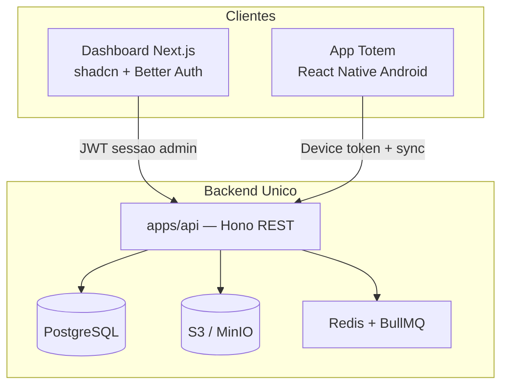
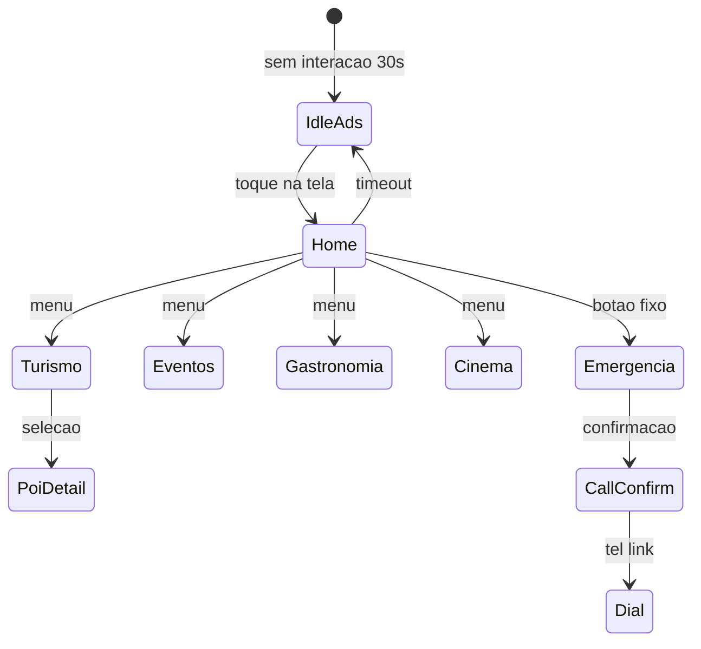

# Plataforma Totem Android — Documentação de Arquitetura

Documentação técnica do ecossistema de totens interativos para turistas e moradores, com dashboard web de gestão e app Android em modo kiosk.

---

## Sumário

1. [Visão geral](#visão-geral)
2. [Componentes do sistema](#componentes-do-sistema)
3. [Estrutura do monorepo](#estrutura-do-monorepo)
4. [Autenticação e multi-tenant](#autenticação-e-multi-tenant)
5. [Modelo de dados](#modelo-de-dados)
6. [API unificada](#api-unificada)
7. [Dashboard web](#dashboard-web)
8. [App Totem Android](#app-totem-android)
9. [Integração Figma MCP](#integração-figma-mcp)
10. [Infraestrutura e deploy](#infraestrutura-e-deploy)
11. [Fases de implementação](#fases-de-implementação)
12. [Decisões técnicas](#decisões-técnicas)
13. [Riscos e mitigações](#riscos-e-mitigações)

---

## Visão geral

O projeto é composto por três aplicações que compartilham um **único backend HTTP**, garantindo consistência de dados, conteúdos e anúncios entre o painel administrativo e os totens em campo.

| Aplicação | Stack | Público |
|-----------|-------|---------|
| **Dashboard** | Next.js, React, shadcn/ui, Better Auth | Operadores, gestores de conteúdo |
| **App Totem** | React Native (Expo), Android | Turistas e moradores |
| **API** | Hono, PostgreSQL, Redis, S3 | Consumida por dashboard e totem |

### Funcionalidades por aplicação

**Dashboard (web)**
- Monitoramento dos totems (online/offline, localização, versão)
- Edição e controle dos conteúdos apresentados
- Analytics e relatórios
- Controle de anúncios e campanhas

**App Totem (Android)**
- Interface touch-friendly para uso público
- Modo idle com anúncios (cinema, eventos, gastronomia, shows)
- Chamados de emergência
- Pontos turísticos e informações locais
- Funcionamento offline com sincronização automática



---

## Componentes do sistema

### Backend único (`apps/api`)

Servidor Hono com API REST versionada em `/v1`. Centraliza:

- CRUD de conteúdos, anúncios, POIs e configurações
- Registro e heartbeat de dispositivos
- Ingestão de eventos de analytics
- Sync delta para totens offline
- Agendamento de publicações via filas

### Dashboard (`apps/dashboard`)

Painel administrativo web para operadores. Autenticação via Better Auth; consome a API para todas as operações de negócio.

### App Totem (`apps/totem`)

Aplicativo Android em modo kiosk. Autenticação por dispositivo (não por usuário final). Sincroniza conteúdo periodicamente e opera offline quando necessário.

### Pacotes compartilhados (`packages/`)

Schema de banco, validadores Zod, tipos TypeScript e componentes shadcn compartilhados entre apps.

---

## Estrutura do monorepo

```
totem-platform/
├── apps/
│   ├── api/              # Hono — backend único
│   ├── dashboard/        # Next.js App Router + shadcn
│   └── totem/            # Expo + React Native (Android)
├── packages/
│   ├── core/             # Zod validators + DTOs TypeScript
│   ├── db/               # Drizzle schema + migrations
│   ├── ui/               # shadcn (dashboard)
│   └── config/           # biome, tsconfig, tailwind
├── docs/
│   ├── ARQUITETURA.md    # Este documento
│   └── design-tokens.md  # Mapeamento Figma → código (a criar)
└── docker-compose.yml    # Postgres, Redis, MinIO local
```

### Por que Hono separado do Next.js?

O totem Android precisa de uma API estável, versionada (`/v1`), com autenticação por dispositivo e sync offline — sem acoplar ao runtime do Next.js. O dashboard usa Better Auth no próprio Next e repassa o token de sessão (ou cookie BFF) para a API.

---

## Autenticação e multi-tenant

### Atores e mecanismos

| Ator | Mecanismo | Escopo |
|------|-----------|--------|
| Operadores do dashboard | Better Auth (email/senha + OAuth opcional) | Sessão web; roles por tenant |
| Totem Android | Registro → `deviceId` + `deviceSecret` → JWT longa duração | Leitura de conteúdo publicado + escrita de heartbeat/analytics |

### Roles (RBAC)

| Role | Permissões |
|------|------------|
| `super_admin` | Gestão global de tenants e usuários |
| `tenant_admin` | Administração completa do tenant |
| `editor` | CRUD de conteúdos, ads e POIs |
| `viewer` | Somente leitura e analytics |

### Isolamento multi-tenant

Toda entidade de negócio carrega `tenantId`. O middleware da API valida o tenant do usuário ou dispositivo em cada request.

### Better Auth (dashboard)

Configurado somente em `apps/dashboard`:

- Rota: `app/api/auth/[...all]/route.ts`
- Adapter Drizzle compartilhando schema em `packages/db`
- Proteção de rotas via `proxy.ts` (Next.js 16)
- Documentação: https://better-auth.com/docs/integrations/next

---

## Modelo de dados

ORM: **Drizzle** sobre **PostgreSQL 16**. Schema definido em `packages/db`.

#### Core

| Tabela | Descrição |
|--------|-----------|
| `tenants` | Cidade/operador (nome, slug, configurações) |
| `users` | Usuários (via Better Auth) |
| `memberships` | Relação user ↔ tenant + role |

#### Totens e Dispositivos

| Tabela | Descrição |
|--------|-----------|
| `devices` | Totem (nome, localização, status, versão app, último heartbeat) |
| `heartbeats` | Histórico online/offline, bateria, storage, IP |

#### Conteúdo & Turismo (Guia Local)

| Tabela | Descrição |
|--------|-----------|
| `points_of_interest` | Pontos turísticos, praias, gastronomia e natureza com coordenadas, Place ID do Google, acessibilidade e metadados flexíveis |
| `hotels` | Hotéis e pousadas (localidade, avaliação, comodidades e faixa de preço) |

#### Eventos e Shows

| Tabela | Descrição |
|--------|-----------|
| `events` | Shows, festivais de música, teatro, eventos gastronômicos e exposições de arte (datas, preços e link para compra de ingressos) |

#### Anúncios (Publicidade)

| Tabela | Descrição |
|--------|-----------|
| `ad_campaigns` | Campanhas de anúncio por tenant com vigência (início/fim) |
| `ad_creatives` | Criativos de anúncio (imagem/vídeo, CTA de destino e duração em segundos para a rotação idle) |

#### Cinema Local

| Tabela | Descrição |
|--------|-----------|
| `movies` | Catálogo de filmes em cartaz (sinopse, gênero, classificação indicativa) |
| `movie_sessions` | Sessões de cinema individuais (sala, horário, áudio dublado/legendado, preço e link) |

#### Utilidades Públicas & Emergência

| Tabela | Descrição |
|--------|-----------|
| `utilities` | Serviços essenciais (saúde/hospitais, segurança, pet/vet e mobilidade/pontos de ônibus) com contatos rápidos e distâncias |
| `emergency_contacts` | Números de contato rápido do tenant (tel:) |

#### Analytics

| Tabela | Descrição |
|--------|-----------|
| `analytics_events` | Logs de uso (`screen_view`, `ad_impression`, `ad_click`, `poi_view`, `emergency_tap`, `session_start`) |

Agregações via views materializadas ou queries otimizadas para o dashboard (por totem, período, campanha).

---

## API unificada

Base URL: `/v1` — validação com Zod (`packages/validators`).

### Endpoints

| Grupo | Dashboard | Totem |
|-------|-----------|-------|
| `/v1/admin/devices` | CRUD, pairing code | register, heartbeat |
| `/v1/admin/content` | CRUD + publish | sync pull (delta) |
| `/v1/admin/ads` | CRUD campanhas | sync creatives |
| `/v1/admin/pois` | CRUD | listagem offline |
| `/v1/admin/emergency` | CRUD contatos | listagem |
| `/v1/admin/analytics` | queries agregadas | ingest events (batch) |
| `/v1/admin/schedules` | CRUD agendamentos | resolved schedule no sync |

### Sync offline (totem)

```
GET /v1/totem/sync?since={timestamp}
```

Retorna delta de conteúdos, ads, POIs e configurações. O app persiste em MMKV/SQLite e exibe sem rede.

### Agendamento

Jobs BullMQ publicam/despublicam conteúdos e campanhas conforme `content_schedules` e `ad_schedules`.

### Mídia

Upload via presigned URL S3. O dashboard faz upload direto; o totem baixa no sync.

---

## Dashboard web

**Stack:** Next.js 15+, React 19, Tailwind v4, shadcn/ui, Better Auth, TanStack Query, Recharts.

### Módulos

1. **Login / onboarding** — autenticação e setup de tenant
2. **Monitoramento** — mapa + lista de totems, status tempo real (heartbeat &lt; 2min = online), alertas offline
3. **CMS de conteúdo** — editor de módulos, drag-and-drop, preview, agendamento
4. **Gestão de anúncios** — campanhas, criativos, targeting, calendário idle
5. **Pontos turísticos** — CRUD com mapa (Leaflet/Mapbox)
6. **Emergência** — configuração de botões e números por tenant
7. **Analytics** — funis, impressões, telas mais vistas, heatmap por totem, export CSV
8. **Administração** — usuários, roles, tenants (`super_admin`)

### Componentes shadcn

Inicializar com `npx shadcn@latest init` e adicionar conforme protótipo Figma:

`sidebar`, `data-table`, `card`, `chart`, `calendar`, `dialog`, `form`, `tabs`, `badge`

---

## App Totem Android

**Stack:** Expo SDK 52+, Expo Router, React Native, `expo-av`, `react-native-mmkv`, `@tanstack/react-query`.

### Fluxo de navegação



### Requisitos Android (kiosk)

| Requisito | Implementação |
|-----------|---------------|
| Modo kiosk | Immersive Mode / `expo-navigation-bar` |
| Boot automático | Config nativa Android no build EAS |
| Touch targets | Mínimo 48dp, tipografia legível à distância |
| Idle | Carrossel de ads com transição suave; prioridade por schedule |
| Emergência | Botões grandes + confirmação antes de `Linking.openURL('tel:...')` |
| Background | Heartbeat a cada 60s + flush de analytics em batch |
| Offline | Sync na inicialização e a cada reconexão |

---

## Integração Figma MCP

O protótipo Figma existente na conta do usuário será aproveitado via MCP na fase de UI.

### Workflow

1. Autenticar MCP Figma (`mcp_auth` no server `plugin-figma-figma`)
2. Carregar skills `figma-use` e `figma-generate-design`
3. Inspecionar protótipo:
   - Extrair tokens (cores, tipografia, spacing, radius)
   - Mapear frames → rotas do dashboard e telas do totem
   - Identificar componentes reutilizáveis
4. Configurar `tailwind.config` / CSS variables do dashboard para espelhar tokens Figma
5. Implementar telas seção por seção, validando com screenshots Figma
6. App totem: extrair tokens manualmente e aplicar em `StyleSheet`/tema RN

### Entregável

`docs/design-tokens.md` — mapeamento Figma → código (cores, fontes, espaçamentos, componentes).

---

## Infraestrutura e deploy

### Desenvolvimento local (`docker-compose.yml`)

| Serviço | Versão | Uso |
|---------|--------|-----|
| PostgreSQL | 16 | Banco principal |
| Redis | 7 | Filas BullMQ |
| MinIO | latest | Storage S3-compatível |

### Variáveis de ambiente (`.env.example`)

```env
# Banco e filas
DATABASE_URL=
REDIS_URL=

# Storage
S3_ENDPOINT=
S3_ACCESS_KEY=
S3_SECRET_KEY=
S3_BUCKET=

# Auth dashboard
BETTER_AUTH_SECRET=
BETTER_AUTH_URL=

# API
API_URL=
JWT_DEVICE_SECRET=
```

### Deploy sugerido

| Componente | Plataforma |
|------------|------------|
| API | Railway / Fly.io / VPS |
| Dashboard | Vercel |
| Banco | Neon ou AWS RDS |
| Storage | Cloudflare R2 ou AWS S3 |
| App Totem | EAS Build (APK/AAB) + Expo Updates (OTA) |

---

## Fases de implementação

### Fase 1 — Fundação (semana 1)

- [ ] Scaffold monorepo + Docker
- [ ] Schema Drizzle + migrations
- [ ] API Hono com health, auth middleware, tenant isolation
- [ ] Better Auth no dashboard (login funcional)

### Fase 2 — Figma + Design System (semana 1–2)

- [ ] Auth Figma MCP + extração de tokens
- [ ] shadcn + layout dashboard (sidebar, header) alinhado ao protótipo
- [ ] Tema RN do totem a partir dos mesmos tokens

### Fase 3 — Conteúdo e ads (semana 2–3)

- [ ] CRUD completo no dashboard (conteúdo, ads, schedules)
- [ ] Upload de mídia
- [ ] Sync endpoint + cache offline no totem
- [ ] Tela idle com rotação de anúncios

### Fase 4 — Totem UX (semana 3–4)

- [ ] Home, módulos turismo/eventos/gastronomia/cinema
- [ ] POI detail + mapa simplificado
- [ ] Emergência com confirmação
- [ ] Analytics ingest

### Fase 5 — Monitoramento e analytics (semana 4–5)

- [ ] Device pairing + heartbeat
- [ ] Dashboard de monitoramento tempo real
- [ ] Gráficos analytics + export
- [ ] Jobs BullMQ para agendamento automático

### Fase 6 — Multi-tenant e hardening (semana 5–6)

- [ ] Gestão de tenants e usuários
- [ ] RBAC completo
- [ ] Testes E2E críticos (API + dashboard)
- [ ] Build Android kiosk + documentação de deploy

---

## Decisões técnicas

| Decisão | Escolha | Motivo |
|---------|---------|--------|
| Backend único | Hono em `apps/api` | Desacoplado, versionável, serve web + mobile |
| ORM | Drizzle | Tipagem forte, compartilhável, Better Auth adapter |
| UI dashboard | shadcn/ui | Alinhado ao protótipo Figma |
| Auth dashboard | Better Auth | Requisito do projeto |
| App mobile | Expo | Velocidade de dev, OTA updates para totens em campo |
| Offline totem | MMKV + sync delta | Totens podem perder rede |
| Filas | BullMQ + Redis | Agendamento de conteúdo/ads |

---

## Riscos e mitigações

| Risco | Mitigação |
|-------|-----------|
| Figma MCP não autenticado | Autenticar no início da Fase 2 |
| Kiosk Android requer config nativa | Documentar passo a passo no README de `apps/totem` |
| Escopo completo é extenso | Fases sequenciais com entregáveis testáveis a cada etapa |

---

*Última atualização: julho de 2026*
